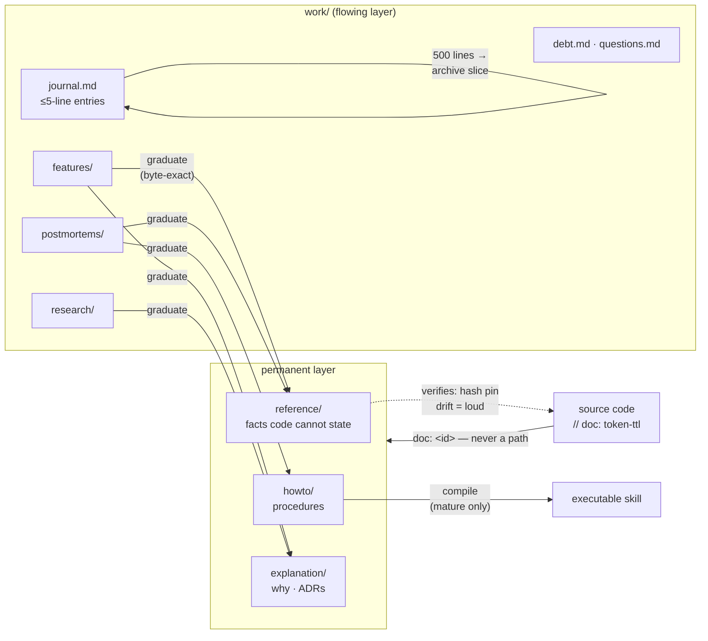
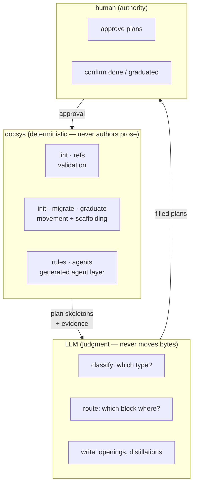
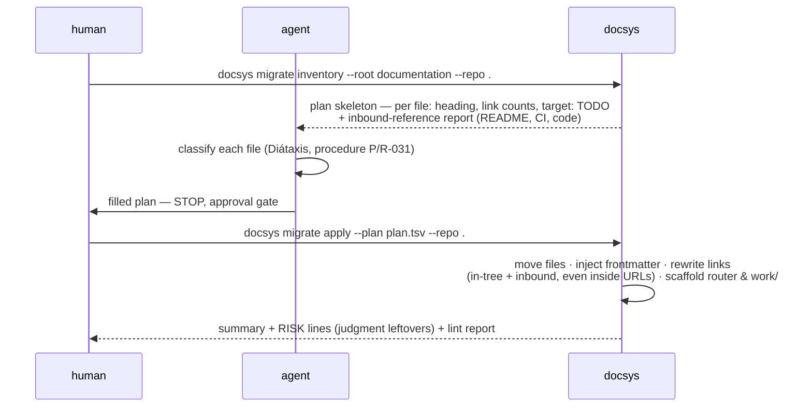
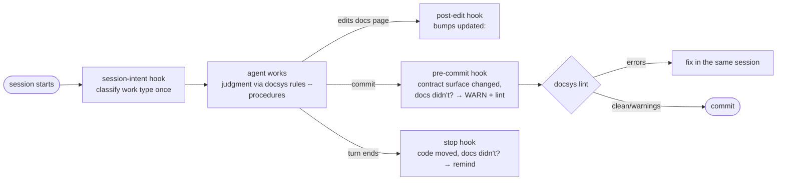
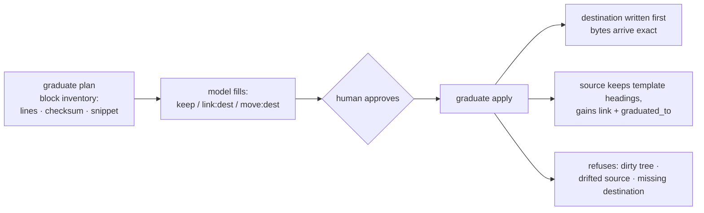

# docsys

**A documentation system that agents and humans keep honest — mechanically.**

Plain markdown + git. A single zero-dependency binary enforces the mechanics;
an LLM handles only the judgment calls, following authored decision procedures.
Nothing lives in two places, nothing goes stale silently, and nothing blocks
your commit unless the damage would be irreversible or silently wrong.

Built spec-first: every behavior traces to a numbered rule in [SPEC.md](SPEC.md)
(133 normative rules, survived six adversarial audit rounds by six independent
models), every implementation-defined choice is registered in
[corpus/DECISIONS.md](corpus/DECISIONS.md), and the conformance corpus keeps the
binary from drifting looser *or* noisier than the rules.

---

## The idea in one diagram

Knowledge flows one way: captured with zero discipline, processed with full
discipline, distilled into a permanent layer the code can point at.



Two contracts carry everything:

- **The identifier is the contract, the filename is cosmetic.** Code cites
  documentation as `doc: <id>`; rename the file, nothing breaks (R-062).
- **Deterministic work belongs to the tool, judgment to the model.** Links,
  frontmatter, uniqueness, budgets, block movement → `docsys`. "Which type is
  this?", "does permanent value remain?" → an agent, following the fifteen
  authored procedures (R-003, §14.3).

## Who does what



The plan file is the boundary: the tool emits an inventory with evidence, the
model fills the mapping, a human approves, the tool executes byte-exactly. The
model never retypes text; the tool never guesses a classification.

## Adopting an existing project (the common case)



Proven on a real firmware repository: 63 flat files migrated, 16 in-tree and
13 inbound references rewritten (README, CONTRIBUTING, CI, even demo payloads
carrying the repo's own GitHub URLs), and the result linted down to exactly the
two pre-existing violations the old tree already had.

## The session loop (agent layer)

`docsys agents` installs four warn-only hooks and a thin skill; `docsys rules`
generates the agent-facing text **from the embedded spec** — there is no
hand-maintained rules copy to drift (R-155).



Hooks **warn and never block** — hard blocking gets hooks disabled entirely,
which removes the protection completely (R-150, a field lesson). Blocking is
reserved for the two outcomes that earn it: irreversible, or silently wrong
(R-151) — a dangling reference blocks, because an agent that cannot resolve a
reference invents an answer.

## Graduation — the heart



"Content is never rewritten, only moved" stopped being a rule the model must
obey and became a guarantee the command enforces (R-090): the model selects
the mapping, the tool copies the bytes.

## Commands

| Command | What it does |
|---|---|
| `docsys lint [--root docs] [--json]` | Full tree validation: frontmatter, ids, links, journal discipline, templates, list grammars. Errors exit 1, warnings don't. |
| `docsys init [--root docs]` | Greenfield skeleton: `.docmeta.yml`, router, journal, debt. |
| `docsys migrate inventory / apply` | Brownfield adoption: evidence-rich plan → approved mapping → mechanical move with link rewriting on both sides of the docs boundary. |
| `docsys refs --repo .` | Validate every `doc: <id>` in the code base against the tree (typos stop being invisible). |
| `docsys graduate plan / apply` | Byte-exact block movement from work files to the permanent layer. |
| `docsys rules --agents-md / --procedures` | Agent text generated from the embedded spec: a ~33-line always-loaded block, and the fifteen decision procedures. |
| `docsys agents` | Install the hooks, `/doc-sync`, and the thin skill under `.claude/`. |

## Try it in five minutes

```sh
cargo build --release          # zero dependencies, one static binary
alias docsys=$PWD/target/release/docsys

# greenfield
mkdir -p demo && cd demo && git init -q
docsys init --root docs
docsys agents                          # hooks + skill under .claude/
docsys rules --agents-md >> AGENTS.md  # the always-loaded block
docsys lint --root docs                # green

# brownfield (any repo with markdown anywhere)
docsys migrate inventory --root <your-docs-dir> --repo . > plan.tsv
#   … fill the TODO targets (this is the judgment step) …
docsys migrate apply --plan plan.tsv --root <your-docs-dir> --repo .
```

## What keeps it honest

- **Severity is doctrine.** Warn by default; block only what is irreversible
  or silently wrong (§2.2, R-151). Every warning names the file that must
  change (R-152).
- **A check that inspected zero units fails** — a dead scan must never read as
  a clean tree (R-011). An unmigrated tree announces itself instead of passing
  silently.
- **Single source of truth, structurally.** Agent text is generated from the
  spec embedded in the binary; the revision history lives in git, not in a
  prose copy that can drift (R-155, §18).
- **The corpus cuts both ways.** Expected outputs are exact: an extra finding
  fails a case as hard as a missing one, so the checker can't grow noisy.
- **Every open decision has a home.** What the spec leaves to implementations
  is decided once, in [corpus/DECISIONS.md](corpus/DECISIONS.md), with the
  reason (R-193) — 24 decisions and counting, several forced by pilot runs on
  real repositories.

## Repository layout

```
SPEC.md               the specification — 133 normative rules + experimental §13
src/                  the reference implementation (Rust, stdlib only)
corpus/
├── DECISIONS.md      register of implementation-defined choices (R-193)
└── cases/            conformance corpus: tree + exact expected findings
tests/                behavior locks for migrate / refs / graduate / agents
```

## Status

Core (layout, identity, lifecycle, graduation, journal, freshness, agent
layer) is implemented and piloted read-only against three real repositories.
Federation (§13) is deliberately **experimental**: its rules bind nothing until
a reference implementation and a second real estate exist — a complex system
that works has to grow from a simple system that works.

## Lineage

Diátaxis (Procida) for the type system · Every Page Is Page One (Baker) for
openings · docs-as-code throughout · and field lessons from two production
repositories, encoded as rules: the 3,800-line journal that taught entry
budgets, the silent rename that taught id-over-path, the ownerless wire
protocol that taught contract ownership, the drowned warning that taught
warn-with-names.
