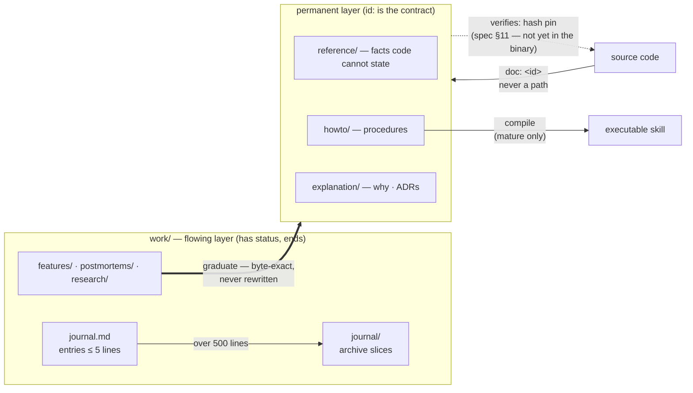
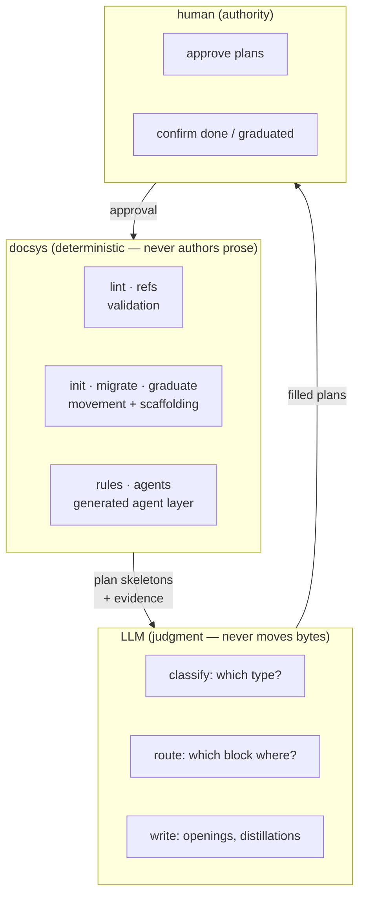
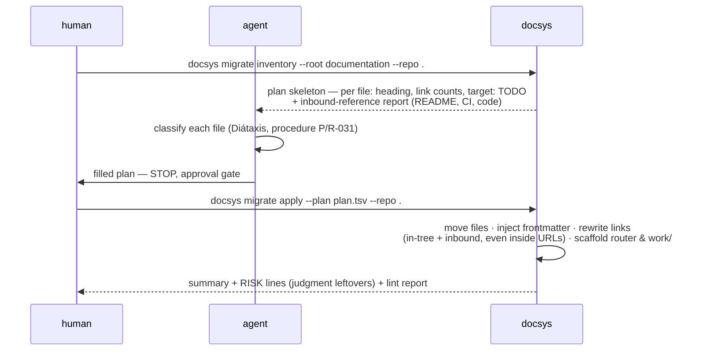
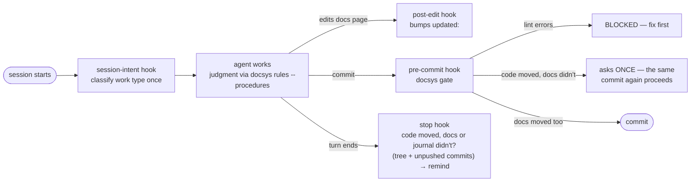
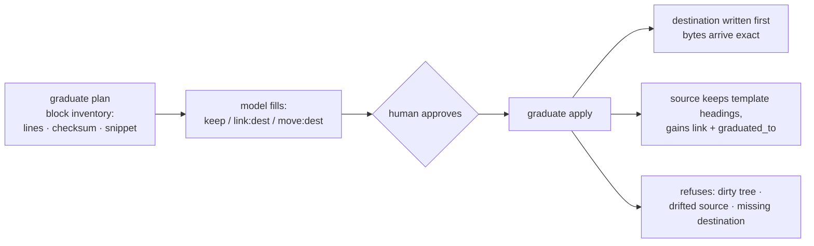

# docsys

[](https://github.com/FatihErtugral/docsys/actions/workflows/ci.yml) [](https://crates.io/crates/docsys)

**A documentation system that agents and humans keep honest — mechanically.**

Plain markdown + git. A single zero-dependency binary enforces the mechanics;
an LLM handles only the judgment calls, following authored decision procedures.
Nothing lives in two places, nothing goes stale silently, and nothing blocks
your commit unless the damage would be irreversible or silently wrong.

Built spec-first: every behavior traces to a numbered rule in [SPEC.md](SPEC.md)
(147 normative rules, survived six adversarial audit rounds by six independent
models), every implementation-defined choice is registered in
[corpus/DECISIONS.md](corpus/DECISIONS.md), and the conformance corpus keeps the
binary from drifting looser *or* noisier than the rules.

---

## The idea in one diagram

Knowledge flows one way: captured with zero discipline, processed with full
discipline, distilled into a permanent layer the code can point at.



Which section of a work file lands in which permanent type is a lookup, not a
guess — the template sections map to destinations (R-049): contract surface →
`reference/`, decisions and rejected alternatives → `explanation/`, procedural
lessons → `howto/`.

Two contracts carry everything:

- **The identifier is the contract, the filename is cosmetic.** Code cites
  documentation as `doc: <id>`; rename the file, nothing breaks (R-062).
- **Deterministic work belongs to the tool, judgment to the model.** Links,
  frontmatter, uniqueness, budgets, block movement → `docsys`. "Which type is
  this?", "does permanent value remain?" → an agent, following the fifteen
  authored procedures (R-003, §14.3).

## Who does what



The plan file is the boundary: the tool emits an inventory with evidence, the
model fills the mapping, a human approves, the tool executes byte-exactly. The
model never retypes text; the tool never guesses a classification.

## Adopting an existing project (the common case)



Proven on a real firmware repository: 63 flat files migrated, 16 in-tree and
13 inbound references rewritten (README, CONTRIBUTING, CI, even demo payloads
carrying the repo's own GitHub URLs), and the result linted down to exactly the
two pre-existing violations the old tree already had.

## The session loop (agent layer)

`docsys agents` installs four hooks, three commands (`/docsys-sync`,
`/docsys-seed`, `/docsys-interview`) and two skills. The hooks are two-line
relays: every decision is made by `docsys hook <event>` in the binary — a real
JSON parser for the payload, heredoc-aware command detection, git paths read
unquoted — and pinned by unit tests (D-051). `docsys rules` generates the
agent-facing text **from the embedded spec**; there is no hand-maintained rules
copy to drift (R-155).



One channel blocks — the pre-commit hook, where exit 2 stops the call and the
model reads the reason: lint **errors** block outright, and the
code-without-docs question **asks once** (the marker lives until HEAD moves,
so a retry that dropped its `git add` is caught, not waved through). The other
hooks warn and never block: a wall gets hooks disabled, a question does not
(R-150, R-151, D-040, D-043, D-049).

## Graduation — the heart



"Content is never rewritten, only moved" stopped being a rule the model must
obey and became a guarantee the command enforces (R-090): the model selects
the mapping, the tool copies the bytes.

## Export — a document for a reader, out of a large tree

A tree is written page by page; a reader wants one document. `export` composes
one, mechanically: bodies are carried **verbatim** (heading levels shift, prose
is never rewritten), every section carries a source stamp (identifier, file,
content hash, date), and the run **refuses to half-compose** — a missing,
flowing, retired or unfetched identifier fails with the complete list.

```sh
docsys export plan --root docs --audience end-user     # what exists for this reader
docsys export feature subghz-listen subghz-record \
  --audience end-user --lang tr --title "SubGHz Guide" \
  --root docs --out guide.md                            # one feature, no map file
```

Two declarations make the same tree serve different readers, and the tool
determines neither of them:

- **`audience:`** on a page (the vocabulary is the tree's own `audiences:`;
  undeclared reads as `developer`). A page of the wrong audience named on a map
  is refused; one reached by `--follow` becomes a named gap — "no end-user
  counterpart exists" is a work item, not a silent omission.
- **`lang:`** per page. `--lang` states the document's intent and warns page by
  page; the tool translates nothing — translation is agent work, and code
  identifiers, product names and quotations keep their original form.

The composer never writes prose. An end-user document exists when end-user
pages exist — the `docsys-export` skill carries that procedure (discover the
gap, author with approval, compose), so the workflow lives in the repository,
not in someone's head.

Regeneration is stateless — a cache is state, and state drifts — but an
unchanged result never touches the output file, so nothing downstream
re-triggers on a no-op.

## Federation — one feature, several repositories

A feature with a foot in three services should still read as one document. A
consumer declares its providers; `fetch` materializes their exported pages
locally; `@namespace/id` composes beside local identifiers.

```yaml
# docs/.docmeta.yml of the consuming (or a thin product) repository
consume_base: "git@github.com:acme/{ns}.git#docs"   # one template…
consume: [auth, billing, payments]                  # …and just names
```

```sh
docsys export manifest --root docs --out manifest.docsys   # each provider publishes
docsys fetch --root docs                                   # consumer materializes
docsys export feature app-side @auth/token-ttl --root docs --out guide.md
```

The manifest is why this scales: an index of ids, hashes, titles and summaries
— **no bodies** — so a refresh downloads what actually changed instead of
cloning estates. On a real 66-page tree the manifest is 20 KB where the
repository is 70 MB. Foreign pages compose only from the verified local state
(never a live query); an unfetched or locally edited materialization is refused
by name, `internal: true` pages never cross the boundary, and every foreign
stamp carries its fetch date so a stale composition is visible.

## Commands

| Command | What it does |
|---|---|
| `docsys adopt [--repo .] [--root docs] [--lang <code>] [--obsidian]` | One-command integration: docmeta (or the full init skeleton on a fresh project), agent assets, `settings.json` when absent, AGENTS.md managed block, git pre-commit gate (warn-mode), and an `ADOPTION.md` report whose checklist carries every judgment call. Idempotent. |
| `docsys seed plan [--target <feature>] [--since <date>] [--memory <dir>]` · `docsys seed apply --plan <file> [--force]` · `docsys seed gaps [--since <date>]` | Brownfield seeding: evidence from history and code, refused when a page covers the feature; the approved rows land under `work/` as tokens and verbatim quotations (D-053, D-058). |
| `docsys debt close <n> [--note <line>]` · `docsys journal add <text> [--title <t>] [--date <d>] [--link <path>]` · `docsys page new <kind> <id> [--title <t>]` | Capture, mechanical: a repaid debt leaves the ledger with its journal line; an entry at its date; a page from its template (D-063). |
| `docsys backlinks <path\|id> [--repo .]` · `docsys mentions [<path\|id>]` · `docsys graph [--format dot\|json\|jsoncanvas] [--repo .]` | Derived navigation, never written into a page: who points at a page (code included), who names it without linking, the whole map (D-064). |
| `docsys adopt --obsidian` | The docs root as an Obsidian vault: absolute links, `_archive/` ignored, `_templates/` as templates, a `stale-work.base` view (D-065). Caveats: `aliases:` means retired ids here; keep Linter's `yaml-timestamp` off. |
| `docsys lint [--root docs] [--repo <dir>] [--json]` | Full tree validation: frontmatter, ids, links, journal discipline, templates, list grammars — both profiles. Inside a git repository (`--repo`, or detected) also the freshness rules: `verifies:` pins recomputed (R-111), `updated:` behind history (R-106), drafts untouched beyond `stale_active_days` (R-085). Errors exit 1, warnings don't. |
| `docsys compile <howto> [--root docs] [--dir .claude] [--force]` | A howto whose steps are complete becomes an executable skill: the page body byte for byte under `.claude/skills/<id>/`, pinned to the page's content hash. Lint fails while the page has moved since the compile (R-094, R-095, D-073). |
| `docsys pin <page> <path> [--symbol <s>]` · `docsys pin --refresh <page>` | Pin a permanent page to a code region — the whole file or one symbol's block — with its SHA-256 (§11); refresh every pin after re-reading the page. Lint fails while a pinned region has moved. |
| `docsys init [--root docs] [--lang <code>] [--profile project\|knowledge-base]` | Greenfield skeleton. `project`: router, journal, debt. `knowledge-base`: the record layer (`raw/inbox/`) and the wiki root. |
| `docsys migrate inventory [--root <dir>] [--repo <dir>]` · `docsys migrate apply --plan <file> [--root <dir>] [--lang <code>] [--repo <dir>]` | Brownfield adoption: evidence-rich plan → approved mapping → mechanical move with link rewriting on both sides of the docs boundary. |
| `docsys refs --repo <dir> [--root <dir>] [--json]` | Validate every `doc: <id>` in the code base against the tree (typos stop being invisible). |
| `docsys graduate plan <work-file> [--root <dir>]` · `docsys graduate apply --plan <file> [--root <dir>] [--force]` | Byte-exact block movement from work files to the permanent layer; `--force` overrides the dirty-tree refusal. |
| `docsys export plan [--audience <a>]` · `docsys export product <map> [--out <file>] [--lang <code>] [--audience <a>]` · `docsys export feature <id>… [--follow] [--title <t>] [--out <file>] [--lang <code>] [--audience <a>]` | Compose a document from permanent pages: a draft map from the tree's own evidence, a whole product from an authored map, or one feature by identifier (`--follow` widens a hop). Bodies verbatim, source-stamped, `--audience` and `--lang` aware. |
| `docsys export manifest [--root <dir>] [--out <file>]` | Publish what this namespace exports — id, type, title, summary, content hash, no bodies. A few KB where a clone is megabytes. |
| `docsys fetch [--root <dir>]` | Materialize consumed namespaces into `.federation/`: manifest first, unchanged pages skipped, provenance recorded. |
| `docsys rules --agents-md \| --procedures [--max-lines <n>] [--write <file>]` | Agent text generated from the embedded spec: a ~40-line always-loaded block, and the fifteen decision procedures. `--max-lines` checks the block against the budget (R-165); `--write` lands it in a file instead of stdout. |
| `docsys agents [--kb] [--dir .claude] [--force]` · `docsys agents --report [--dir .claude]` | Install the agent layer (`--report`: list the layer already installed and the shell calls it makes): four relay hooks + `/docsys-sync`, `/docsys-seed`, `/docsys-interview` + the docsys and export skills for a project, or the four knowledge-base organs (capture · ingest · audit · lookup) with `--kb`. Hooks carry their template version; `--force` refreshes them. |
| `docsys hook pre-tool-use\|stop\|post-tool-use\|user-prompt-submit [--repo .] [--root docs]` | The hook logic itself, reading the agent harness payload on stdin (D-051). |
| `docsys gate [--repo .] [--root docs] [--range <a>...<b>]` · `docsys doctor [--repo .] [--root docs] [--dir .claude]` | The commit-time question the binary computes (lint + code-without-docs); with `--range`, the same question over a pull request, failing when unanswered — what the CI workflow runs. And the liveness check: every hook present, executable, wired under the right event, up to date (D-040, D-047). |

## Quick start

```sh
cargo install docsys      # zero dependencies → one static binary on your PATH
cd your-project           # any git repository, with or without documentation
docsys adopt              # the whole setup, one command — what it writes is listed below
docsys doctor             # is the pipeline alive? every hook present, wired, up to date
```

No Rust toolchain? Grab a prebuilt binary for Linux (static musl,
x86_64/aarch64), macOS (Intel/Apple Silicon), or Windows from the
[releases page](https://github.com/FatihErtugral/docsys/releases) and put it
on your PATH.

`adopt` is idempotent — re-run it after an upgrade and only what changed is
rewritten. It lands:

- `docs/` — the skeleton when none exists (`.docmeta.yml`, router, journal,
  debt, questions, `_templates/`); an existing tree is left as it is
- `.claude/hooks/`, `.claude/commands/`, `.claude/skills/` — four relay hooks,
  `/docsys-sync`, `/docsys-seed`, `/docsys-interview`, the docsys and export
  skills
- `.claude/settings.json` — the hook wiring, written only when the file does
  not exist (an existing one is never clobbered; the snippet to merge goes on
  the report)
- `AGENTS.md` — a managed block generated from the embedded spec
- `.git/hooks/pre-commit` — the lint gate, in warn mode until the tree is
  clean
- `ADOPTION.md` — the report, with a checklist of every judgment call left to
  you

Then open an agent session in that directory and work as usual. Three things
happen without being asked:

- the first message gets a routing block — name the work type (feature / bug /
  refactor / research / idea) and where each one lands
- editing a page under `docs/` bumps its `updated:` by itself
- committing code without touching docs is asked about once, naming what
  moved; the same commit again proceeds
- and CI asks the same questions of every push and pull request: `adopt`
  writes `.github/workflows/docsys.yml` when the repository has a `.github/`,
  and the git pre-commit gate is hard as soon as the tree lints clean

`docsys lint --root docs` is the check CI runs: errors exit 1, warnings do
not. Everything else — feeling the severity doctrine on a clean tree, seeding
a project that has no documentation, the capture commands, migrating an
existing tree, a personal knowledge base — is a guided tour below.

## Guided tours

### 1 · Feel it on a clean project (5 minutes)

```sh
mkdir demo && cd demo && git init -q
docsys init --root docs      # skeleton: .docmeta.yml, router, journal, debt, questions, _templates/
docsys lint --root docs      # green
```

Now break it on purpose and watch the severity doctrine work:

```sh
# a dangling wiki-link — silently wrong, so it BLOCKS
echo "See [[reference/ghost|ghost]]" >> docs/index.md
docsys lint --root docs      # ERROR R-071 · exit 1

# a bare permanent page — reversible, so it only WARNS
mkdir -p docs/reference && echo "naked page" > docs/reference/x.md
docsys lint --root docs      # WARN R-050 (frontmatter) + WARN R-034 (orphan)
```

### 2 · The agent layer, in detail

```sh
docsys rules --procedures | less       # the 15 authored decision procedures
docsys agents --report                 # what is installed, and the shell calls it makes
```

Test fixtures that carry a deliberately broken `doc:` reference (probe files, a
check's own negative case) go under a directory listed in `scan_exclude` — the
scanner reads every tracked text file (R-077), so nowhere else in the tree can hold
one. Scope note: `docsys lint` reads the documentation root only; `.claude/rules/*.md`,
`AGENTS.md` and code are the province of `docsys refs --repo .`, which checks the
`doc:` references they carry. `adopt` writes `.claude/settings.json` only when the file does not exist — an
existing one may carry MCP servers and permission lists, so the merge snippet
lands on the `ADOPTION.md` checklist instead of being clobbered. Then open an
agent session in that directory and try the loop:

- open with something ambiguous ("let's look at the timer") → the
  session-intent hook asks for the work type, once
- have it edit a `docs/reference/` page → `updated:` bumps itself
- change code and try to commit without touching docs → the pre-commit hook
  asks once, naming what moved; the same commit again proceeds
- type `/docsys-sync` → a drift report over `docsys lint`, `docsys refs` and
  `docsys seed plan --since`
- a pre-commit gate of your own that wants a marker in every generated file?
  declare it once — `generated_preamble: "<!-- … -->"` in `.docmeta.yml` — and
  every file docsys writes opens with it (D-056)

### 3 · A project with no documentation at all — seeding

```sh
docsys adopt                                   # skeleton, hooks, templates, questions ledger
docsys seed plan --repo . --root docs           # feature inventory: what history names, what is covered
docsys seed plan --repo . --root docs --target weather   # one feature's history as evidence
```

The plan is evidence, never prose: commits with their bodies, files by touch
count, the birth date, manifests, `doc:` citations, the code's own comment
blocks verbatim. `/docsys-seed <feature>` presents it to the builder — plain
questions, one at a time, nothing written until confirmed — and what the
builder adds is what history cannot say: why, what is still open, what comes
next. `docsys seed apply --plan SEED.tsv` then lands the approved rows under
`work/` as tokens and verbatim quotations (a reserved research page, the
builder's answers, dated journal entries, a postmortem quoting its commit,
debt and question items). `/docsys-interview` runs it feature by feature,
resumable. A feature a page already covers is refused by name; from there the
hooks keep it current.

### 4 · Capture and navigation

```sh
docsys journal add "Wire format settled; details on the page" --link reference/wire
docsys debt close 3 --note "measured twice, held"     # item leaves the ledger, journal records it
docsys page new feature dark-mode                      # from _templates/feature.md
docsys backlinks token-ttl --repo .                    # pages and code pointing at a page
docsys mentions                                        # prose naming a page without a link
docsys graph --format jsoncanvas --repo . > docs/map.canvas
docsys adopt --obsidian                                # the docs root as an Obsidian vault
```

Opening the tree in Obsidian works as-is with three settings `adopt --obsidian`
writes (absolute link format, `_archive/` and `.federation/` ignored,
`_templates/` as the templates folder). Two caveats: `aliases:` means retired
identifiers here and autocomplete names there; and keep the Linter plugin's
`yaml-timestamp` off — it fights `updated:` (D-065).

### 5 · A real repository, safely (clone first)

```sh
git clone <your-repo> /tmp/pilot && cd /tmp/pilot
docsys migrate inventory --root <docs-dir> --repo . > plan.tsv
```

Open `plan.tsv`: one evidence line per file (first heading, link counts,
inbound references from README/CI/code) and a `TODO` target. Filling the
targets is the judgment step — do it yourself, or hand it to an agent in that
directory; classification is exactly what the P/R-031 procedure is for. Then:

```sh
docsys migrate apply --plan plan.tsv --root <docs-dir> --repo .
```

It moves files, injects frontmatter, rewrites links on both sides of the docs
boundary (README included), reports what it could not map as RISK lines, and
lints the result. Don't like it? `git checkout . && git clean -fd` — it was a
clone; zero risk.

### 6 · A personal knowledge base (the other profile)

The same mechanics, a different layout: notes land with zero discipline, get
distilled with full discipline, and every claim keeps its evidence.

```sh
mkdir brain && cd brain && git init -q
docsys init --profile knowledge-base --root .   # raw/inbox/ + wiki/ + docmeta
docsys agents --kb --root .                     # capture · ingest · audit · lookup
$EDITOR .docmeta.yml                            # declare your domains:
```

Then work in natural language with an agent in that directory: *"note this"*
lands in `raw/inbox/`; *"process my inbox"* distils each note into
`wiki/<domain>/<type>/`, archives the source and routes the page; *"audit the
wiki"* verifies pages against their sources **in another session** and records
who verified what; *"what do my notes say about X"* answers with the page path
— or says the base does not have it.

What the binary guarantees underneath: `raw/` is content-immutable (an edited
or deleted record is an error; relocation is the expected flow), every
`sources:` entry must resolve, a `verified` page must record `verified_by:` and
`verified_rev:`, and a page that changes drops back to `unverified`.

## What keeps it honest

- **Severity is doctrine.** Warn by default; block only what is irreversible
  or silently wrong (§2.2, R-151). Every warning names the file that must
  change (R-152).
- **Drift is caught by a hash, not by a reviewer.** A page pins the code it
  describes (`verifies:`); when that region moves, lint fails until someone
  re-reads the page and refreshes the pin. History dates every page, so a
  freshness field that lies and a draft left to rot are errors too (§11,
  R-085, R-106, D-070).
- **A check that inspected zero units fails** — a dead scan must never read as
  a clean tree (R-011). An unmigrated tree announces itself instead of passing
  silently.
- **Single source of truth, structurally.** Agent text is generated from the
  spec embedded in the binary; the revision history lives in git, not in a
  prose copy that can drift (R-155, §18).
- **The corpus cuts both ways.** Expected outputs are exact: an extra finding
  fails a case as hard as a missing one, so the checker can't grow noisy.
- **Every open decision has a home.** What the spec leaves to implementations
  is decided once, in [corpus/DECISIONS.md](corpus/DECISIONS.md), with the
  reason (R-193) — 65 decisions and counting, most of them forced by real
  repositories: a formatter that reflowed a config field, a build tree that
  turned 147 findings into 9,171, an example citation that failed the rule it
  was teaching.

## Repository layout

```
SPEC.md               the specification — 147 normative rules + experimental §13
src/                  the reference implementation (Rust, stdlib only)
corpus/
├── DECISIONS.md      register of implementation-defined choices (R-193)
└── cases/            conformance corpus: tree + exact expected findings
tests/                behavior locks for migrate · refs · graduate · adopt ·
                      doctor · hooks (executed for real) · seed · graph ·
                      knowledge base (git-observable) · export · federation
```

## Status

Core (layout, identity, lifecycle, graduation, journal, agent layer) is
implemented and field-proven: four repositories adopted end to end — the hook
layer hardened by a day of live reports, one per release from 0.4.2 to 0.5.1 —
and a personal knowledge base whose constitution predated the spec and matched
it. Both profiles — `project` and `knowledge-base` — are checked.

Brownfield seeding (0.6–0.8) reads a project's history and the code's own
comment blocks as evidence for a conversation with the builder, lands only what
was confirmed, and refuses a feature a page already covers. Capture commands and
derived navigation (0.9) make the right single-file write the cheap one and
give the tree backlinks, unlinked mentions and a graph. Freshness (0.11) is
mechanical: a page pins a code region (`verifies:`, §11) and lint recomputes
the hash on every run; history dates every page, so an `updated:` behind the
last commit and a draft nobody touched for `stale_active_days` are errors, not
hopes. `adopt` writes the CI workflow and hardens the pre-commit gate once the
tree is clean. A mature howto compiles into an executable skill that carries
its source hash, and goes stale with the page (R-094, R-095).

Federation (§13) stays marked **experimental** in the spec, and the
implementation now has its first working slice: manifests, `fetch` over
filesystem paths and git URLs, and `@namespace/id` composition, proven between
repositories on one machine. Consuming a provider over HTTP without a
checkout, and the consumer-impact report for a retired identifier, are the
next slices — the rules there bind nothing until a second real estate exists.

## License

Licensed under either of [Apache License, Version 2.0](LICENSE-APACHE) or
[MIT license](LICENSE-MIT) at your option. Unless you explicitly state
otherwise, any contribution intentionally submitted for inclusion in this work
by you, as defined in the Apache-2.0 license, shall be dual licensed as above,
without any additional terms or conditions.

## Lineage

Diátaxis (Procida) for the type system · Every Page Is Page One (Baker) for
openings · docs-as-code throughout · and field lessons from two production
repositories, encoded as rules: the 3,800-line journal that taught entry
budgets, the silent rename that taught id-over-path, the ownerless wire
protocol that taught contract ownership, the drowned warning that taught
warn-with-names.
