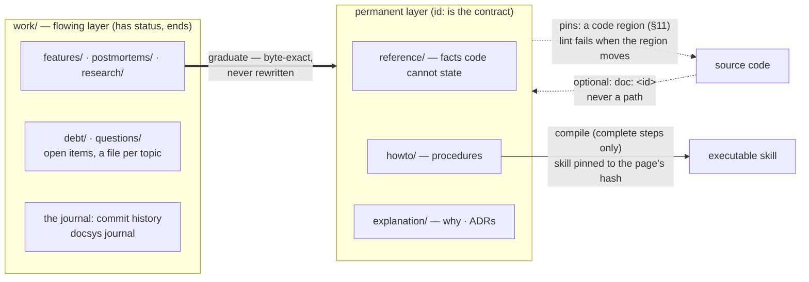
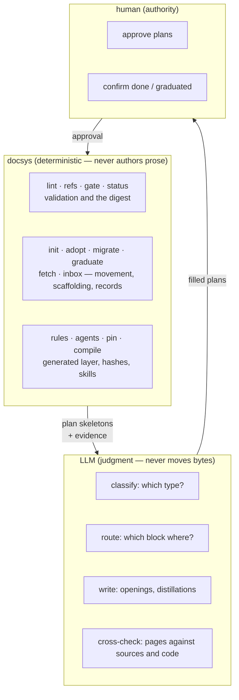
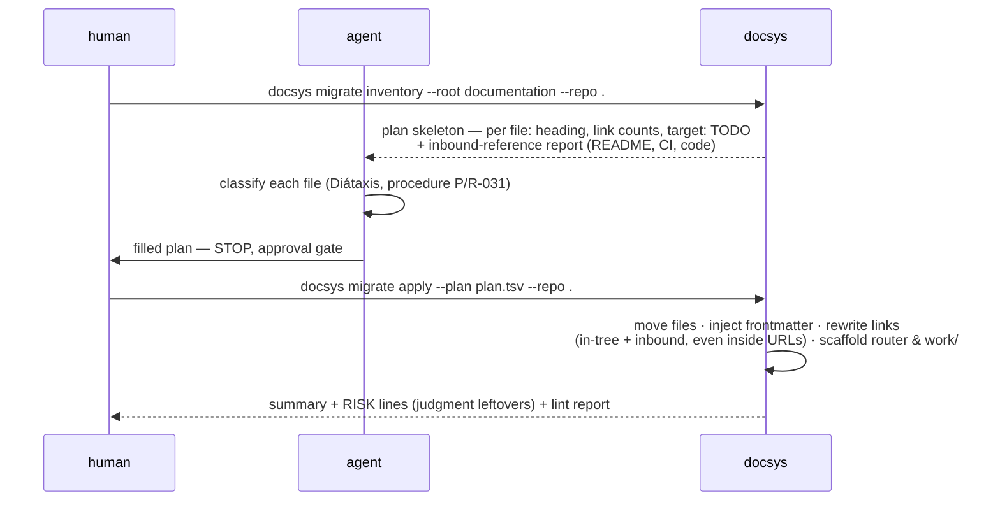
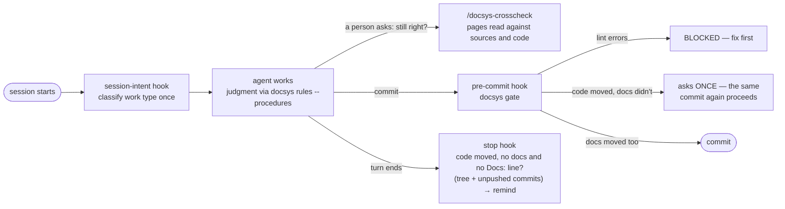
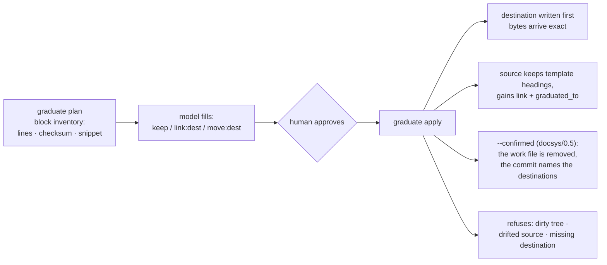
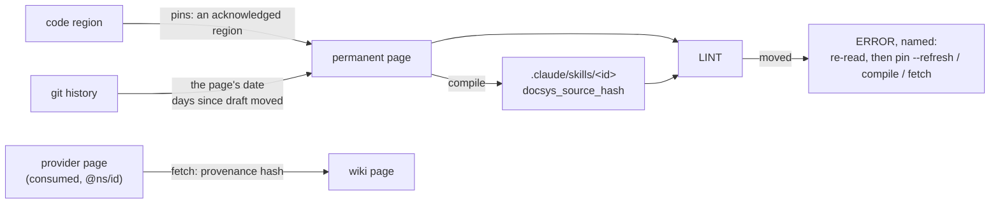
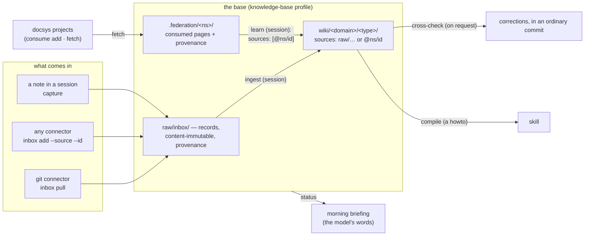

# docsys

[](https://github.com/FatihErtugral/docsys/actions/workflows/ci.yml) [](https://crates.io/crates/docsys)

**A documentation system that agents and humans keep honest — mechanically.**

Plain markdown + git. A single zero-dependency binary enforces the mechanics;
an LLM handles only the judgment calls, following authored decision procedures.
Nothing lives in two places, nothing goes stale silently, and nothing blocks
your commit unless the damage would be irreversible or silently wrong.

Built spec-first: every behavior traces to a numbered rule in [SPEC.md](SPEC.md)
(152 normative rules, survived six adversarial audit rounds by six independent
models, plus two experimental sections — federation and connectors — that bind
nothing until real use settles them), every implementation-defined choice is
registered in [corpus/DECISIONS.md](corpus/DECISIONS.md), and the conformance
corpus keeps the binary from drifting looser *or* noisier than the rules.

Two profiles, one binary. A **project** keeps its documentation next to its
code and honest against it; a **knowledge base** is a person's memory — and,
consuming the projects, an assistant's: `docsys assistant --root ~/jarvis
--projects ~/code` is the whole setup.

---

## The idea in one diagram

Knowledge flows one way: captured with zero discipline, processed with full
discipline, distilled into a permanent layer the code can point at.


```mermaid
flowchart LR
    subgraph WORK["work/ — flowing layer (has status, ends)"]
        direction TB
        F["features/ · postmortems/ · research/"]
        J["debt/ · questions/<br/>open items, a file per topic"]
        H["the journal: commit history<br/>docsys journal"]
    end

    subgraph PERM["permanent layer (id: is the contract)"]
        direction TB
        REF["reference/ — facts code cannot state"]
        HOW["howto/ — procedures"]
        EXP["explanation/ — why · ADRs"]
    end

    CODE["source code"]
    SKILL["executable skill"]

    F ==>|"graduate — byte-exact,<br/>never rewritten"| PERM
    CODE -.->|"optional: doc: &lt;id&gt;<br/>never a path"| PERM
    PERM -.->|"pins: a code region (§11)<br/>lint fails when the region moves"| CODE
    HOW -->|"compile (complete steps only)<br/>skill pinned to the page's hash"| SKILL
```

Which section of a work file lands in which permanent type is a lookup, not a
guess — the template sections map to destinations (R-049): contract surface →
`reference/`, decisions and rejected alternatives → `explanation/`, procedural
lessons → `howto/`.

Two contracts carry everything:

- **The identifier is the contract, the filename is cosmetic.** Code that cites
  documentation cites `doc: <id>`; rename the file, nothing breaks (R-062).
- **Deterministic work belongs to the tool, judgment to the model.** Links,
  frontmatter, uniqueness, budgets, block movement → `docsys`. "Which type is
  this?", "does permanent value remain?" → an agent, following the fifteen
  authored procedures (R-003, §14.3).

## Who does what


```mermaid
flowchart TD
    subgraph TOOL["docsys  (deterministic — never authors prose)"]
        T1[lint · refs · gate · status<br/>validation and the digest]
        T2[init · adopt · migrate · graduate<br/>fetch · inbox — movement, scaffolding, records]
        T3[rules · agents · pin · compile<br/>generated layer, hashes, skills]
    end
    subgraph MODEL["LLM  (judgment — never moves bytes)"]
        M1[classify: which type?]
        M2[route: which block where?]
        M3[write: openings, distillations]
        M4[cross-check: pages against sources and code]
    end
    subgraph HUMAN["human  (authority)"]
        H1[approve plans]
        H2["confirm done / graduated"]
    end

    TOOL -- "plan skeletons<br/>+ evidence" --> MODEL
    MODEL -- "filled plans" --> HUMAN
    HUMAN -- approval --> TOOL
```

The plan file is the boundary: the tool emits an inventory with evidence, the
model fills the mapping, a human approves, the tool executes byte-exactly. The
model never retypes text; the tool never guesses a classification.

## Adopting an existing project (the common case)


```mermaid
sequenceDiagram
    participant U as human
    participant A as agent
    participant T as docsys

    U->>T: docsys migrate inventory --root documentation --repo .
    T-->>A: plan skeleton — per file: heading, link counts, target: TODO<br/>+ inbound-reference report (README, CI, code)
    A->>A: classify each file (Diátaxis, procedure P/R-031)
    A->>U: filled plan — STOP, approval gate
    U->>T: docsys migrate apply --plan plan.tsv --repo .
    T->>T: move files · inject frontmatter · rewrite links<br/>(in-tree + inbound, even inside URLs) · scaffold router & work/
    T-->>U: summary + RISK lines (judgment leftovers) + lint report
```

Proven on a real firmware repository: 63 flat files migrated, 16 in-tree and
13 inbound references rewritten (README, CONTRIBUTING, CI, even demo payloads
carrying the repo's own GitHub URLs), and the result linted down to exactly the
two pre-existing violations the old tree already had.

## The session loop (agent layer)

`docsys agents` installs the relay hooks — three on a docsys/0.5 tree, and on
a docsys/0.4 tree a fourth that keeps `updated:` — five commands (`/docsys-sync`,
`/docsys-seed`, `/docsys-interview`, `/docsys-upgrade`, `/docsys-crosscheck`)
and two skills. The hooks are two-line
relays: every decision is made by `docsys hook <event>` in the binary — a real
JSON parser for the payload, heredoc-aware command detection, git paths read
unquoted — and pinned by unit tests (D-051). `docsys rules` generates the
agent-facing text **from the embedded spec**; there is no hand-maintained rules
copy to drift (R-155).


```mermaid
flowchart LR
    S([session starts]) --> SI["session-intent hook<br/>classify work type once"]
    SI --> WORK["agent works<br/>judgment via docsys rules --procedures"]
    WORK -- "a person asks: still right?" --> CC["/docsys-crosscheck<br/>pages read against sources and code"]
    WORK -- "commit" --> PC["pre-commit hook<br/>docsys gate"]
    WORK -- "turn ends" --> ST["stop hook<br/>code moved, no docs and no Docs: line?<br/>(tree + unpushed commits) → remind"]
    PC -- "lint errors" --> BLOCK[BLOCKED — fix first]
    PC -- "code moved, docs didn't" --> ASK["asks ONCE — the same<br/>commit again proceeds"]
    PC -- "docs moved too" --> DONE([commit])
```

One channel blocks — the pre-commit hook, where exit 2 stops the call and the
model reads the reason: lint **errors** block outright, and the
code-without-docs question **asks once** (the marker lives until HEAD moves,
so a retry that dropped its `git add` is caught, not waved through); under
`commit_policy: require` it refuses every time, and the end of a turn holds once
(R-209). Otherwise the hooks warn and never block: a wall gets hooks disabled, a
question does not (R-151, D-040, D-043, D-049).

**Strict mode.** A team that wants the wall declares it: `commit_policy:
require` in `.docmeta.yml` (R-209, D-093). Then a commit that touches code with
no documentation change is refused every time — by the relay in the session
and by the git hook at the terminal — until the work is recorded (a work file
under `work/<category>/`, or at minimum a `Docs: <why>` line in the commit
message, which the `commit-msg` hook reads); and the end of a turn holds the session once when code changed
without its record, because the conversation that holds the reasons may be
closed by the time the commit lands. `DOCSYS_SKIP=1` still bypasses, but under
`require` it leaves a dated debt item — an undocumented commit, or a lint error
carried past the gate, is visible debt, never a silent hole. The first turn carries `<docs-in-hand>`: the pages the
tree already has, the work in flight, the policy — so the
agent routes the work against what exists.

The same relays serve a knowledge base (`docsys agents --kb`); the binary
reads the root's profile and changes what they guard: a `Write`/`Edit` on an
existing `raw/` record is blocked (the one irreversible write), the first turn
names the organs instead of the work types, and the end of a turn names what
waits in the inbox (D-076).

## Graduation — the heart


```mermaid
flowchart LR
    PLAN["graduate plan<br/>block inventory:<br/>lines · checksum · snippet"] --> FILL["model fills:<br/>keep / link:dest / move:dest"]
    FILL --> APPROVE{human approves}
    APPROVE --> APPLY["graduate apply"]
    APPLY --> D1["destination written first<br/>bytes arrive exact"]
    APPLY --> D2["source keeps template headings,<br/>gains link + graduated_to"]
    APPLY --> D4["--confirmed (docsys/0.5):<br/>the work file is removed,<br/>the commit names the destinations"]
    APPLY --> D3["refuses: dirty tree ·<br/>drifted source · missing destination"]
```

"Content is never rewritten, only moved" stopped being a rule the model must
obey and became a guarantee the command enforces (R-090): the model selects
the mapping, the tool copies the bytes.

## Sources and cross-checks — a page is read, not stamped

Documentation forms while the work happens, by whoever does it — the agent
included. A page carries no verification state: nothing in it, beside it or
in history says it was checked, so nothing conflicts on merge and nobody keeps
a list of who may vouch (§3.2, D-130).

- A permanent page written from evidence, or changed in substance, names in
  `sources:` what its claims rest on, and its pins say when the code it
  describes moved (§11). It is readable on day one and says what it is.
- When a person wants pages checked, they ask for a cross-check:
  `/docsys-crosscheck` has an agent read the pages they name — or every page
  changed since a revision — against their sources and the code their pins
  resolve to now. `docsys crosscheck` lists what each page rests on and
  writes nothing; the agent corrects what the code or a source contradicts in
  one ordinary commit, and records what it cannot settle as a question or a
  debt item (D-131).
- A docsys/0.4 tree keeps 0.15.1's verification — `verification:`, `docsys
  verify` and the `maintainers:` list — until `docsys upgrade` moves it
  (D-118).

```sh
docsys crosscheck reference/token-ttl     # one page, its sources and its pinned lines
docsys crosscheck --since origin/main     # every page this branch changed, or whose consumed source moved
```

## Freshness — drift is a hash, not a reviewer

Documentation goes wrong quietly: the code moves, the page does not. Four
checks make that loud, all of them errors, none of them a reviewer's memory:


```mermaid
flowchart LR
    CODE["code region"] -- "pins: an acknowledged region" --> PAGE["permanent page"]
    PAGE -- "compile" --> SKILL[".claude/skills/&lt;id&gt;<br/>docsys_source_hash"]
    HIST["git history"] -- "the page's date<br/>days since draft moved" --> PAGE
    PROV["provider page<br/>(consumed, @ns/id)"] -- "fetch: provenance hash" --> WIKI["wiki page"]
    PAGE --> LINT
    SKILL --> LINT
    LINT -- "moved" --> ERR["ERROR, named:<br/>re-read, then pin --refresh / compile / fetch"]
```

- **`pins:`** — `docsys pin <page> <path> [--symbol <s>]` records a code
  region's SHA-256 beside the page, as an acknowledgement under
  `<root>/.pins/<page-id>/` (a `docsys/0.4` tree names the list `verifies:`
  and keeps the hash on the page);
  lint recomputes it on every run and a moved region is an error until the
  page is re-read and `pin --refresh`ed (§11, R-111, D-119). A symbol resolves to its declaration — never to a use, a comment
  or a string — read per language family (Rust; TS/JS and the `<script>` of
  Vue and Svelte files; Python; Go; a generic rule for other brace
  languages), and `Class.method` or `Type::method` resolves inside its
  owner. A symbol that is only used, or declared more than once, is an error
  naming the lines, never a guess (D-106; a `docsys/0.4` tree keeps D-069's
  resolution). Prefer a symbol to a large file: every edit to a whole-file
  pin stales the page, and `pin` says so above 300 lines.
- **History** — one `git log` walk dates every page: a page's date is its last
  content change, never a field the page carries (R-050, D-122), and a
  `draft`/`active`/`done` file untouched beyond `stale_active_days` is an
  error (R-085, D-070, D-071).
- **Compiled skills** — `docsys compile <howto>` carries the page's hash; the
  skill is an error once the page moved (R-095).
- **CI** — `adopt` writes `.github/workflows/docsys.yml` (lint, refs, and
  `gate --range` on a pull request), and the pre-commit gate is hard as soon
  as the tree lints clean (D-072). The workflow runs on pull requests and
  pushes to the default branch with `permissions: contents: read`, cancels a
  superseded run, and installs the docsys version the tree pins
  (`.docsys-version`): `cargo install docsys --version <v> --locked`, cached,
  on `ubuntu-latest`. `--ci-runner <label>[,<label>…]` names other runners,
  and `--ci-install release` installs the release archive instead — for
  runners without a Rust toolchain: the version and each archive's sha256,
  which `docsys upgrade` reads from the release and writes into the step,
  reviewed with the upgrade; a pull request that moves `.docsys-version`
  alone installs nothing. Line 1 records these
  parameters and a hash of the file: a file nobody edited can be regenerated
  with them, and an edited one is yours (D-111).

## Export — a document for a reader, out of a large tree

A tree is written page by page; a reader wants one document. `export` composes
one, mechanically: bodies are carried **verbatim** (heading levels shift, prose
is never rewritten), every section carries a source stamp (identifier, file,
content hash, date), and the run **refuses to half-compose** — a missing,
flowing, retired or unfetched identifier fails with the complete list.

```sh
docsys export plan --root docs --audience end-user     # what exists for this reader
docsys export feature subghz-listen subghz-record \
  --audience end-user --lang tr --title "SubGHz Guide" \
  --root docs --out guide.md                            # one feature, no map file
```

Two declarations make the same tree serve different readers, and the tool
determines neither of them:

- **`audience:`** on a page (the vocabulary is the tree's own `audiences:`;
  undeclared reads as `developer`). A page of the wrong audience named on a map
  is refused; one reached by `--follow` becomes a named gap — "no end-user
  counterpart exists" is a work item, not a silent omission.
- **`lang:`** per page. `--lang` states the document's intent and warns page by
  page; the tool translates nothing — translation is agent work, and code
  identifiers, product names and quotations keep their original form.

The composer never writes prose. An end-user document exists when end-user
pages exist — the `docsys-export` skill carries that procedure (discover the
gap, author with approval, compose), so the workflow lives in the repository,
not in someone's head.

Regeneration is stateless — a cache is state, and state drifts — but an
unchanged result never touches the output file, so nothing downstream
re-triggers on a no-op.

## Federation — one feature, several repositories

A feature with a foot in three services should still read as one document. A
consumer declares its providers; `fetch` materializes their exported pages
locally; `@namespace/id` composes beside local identifiers.

```yaml
# docs/.docmeta.yml of the consuming (or a thin product) repository
consume_base: "git@github.com:acme/{ns}.git#docs"   # one template…
consume: [auth, billing, payments]                  # …and just names
```

```sh
docsys export manifest --root docs --out manifest.docsys   # each provider publishes
docsys fetch --root docs                                   # consumer materializes
docsys export feature app-side @auth/token-ttl --root docs --out guide.md
```

The manifest is why this scales: an index of ids, hashes, titles and summaries
— **no bodies** — so a refresh downloads what actually changed instead of
cloning estates. On a real 66-page tree the manifest is 20 KB where the
repository is 70 MB. Foreign pages compose only from the fetched local state
(never a live query); an unfetched or locally edited materialization is refused
by name, `internal: true` pages never cross the boundary, and every foreign
stamp carries its fetch date so a stale composition is visible. A provider
that publishes no manifest is still consumable — the tree is the index then.

The consumer's list grows without hand-editing and lives nowhere but in its
own `.docmeta.yml`: `docsys consume discover ~/code` lists the docsys trees
under a directory, `docsys consume add <path|git-url>` appends one, reading
the provider's `namespace:` (which `adopt` writes into every tree). A consumed
page is evidence too: a knowledge-base page may cite `@namespace/id` in its
`sources:`, and `docsys lookup <words>` searches local and consumed pages in
one pass (D-074, D-075, D-078).

## An assistant's memory — the knowledge base, its connectors, staying current

The other profile is a person's memory. Consuming the person's projects, it
becomes an assistant's — and the mechanics are the same ones above, pointed
the other way.


```mermaid
flowchart LR
    subgraph IN["what comes in"]
        GIT["git connector<br/>inbox pull"]
        CONN["any connector<br/>inbox add --source --id"]
        NOTE["a note in a session<br/>capture"]
    end
    subgraph BASE["the base (knowledge-base profile)"]
        RAW["raw/inbox/ — records,<br/>content-immutable, provenance"]
        WIKI["wiki/&lt;domain&gt;/&lt;type&gt;/<br/>sources: raw/… or @ns/id"]
        FED[".federation/&lt;ns&gt;/<br/>consumed pages + provenance"]
    end
    PROJ["docsys projects<br/>(consume add · fetch)"]
    GIT & CONN & NOTE --> RAW
    RAW -- "ingest (session)" --> WIKI
    PROJ -- "fetch" --> FED
    FED -- "learn (session):<br/>sources: [@ns/id]" --> WIKI
    WIKI -- "cross-check (on request)" --> FIX["corrections, in an ordinary commit"]
    WIKI -- "compile (a howto)" --> SKILL["skill"]
    BASE -- "status" --> BRIEF["morning briefing<br/>(the model's words)"]
```

- **Records, not pages.** A connector lands one file per item in `raw/inbox/`
  with its provenance (`source`, `source_id`, `title`, `captured`, `url`); the
  same item lands once, so a schedule is safe; no record is ever edited — the
  hook blocks the attempt. `docsys inbox add` is the gate every connector
  calls; the git connector (`docsys inbox pull <repo>`) is built in and skips
  bookkeeping commits unless `--all` (§20, D-079).
- **Learning from projects.** A page distilled from consumed pages cites them
  as `@namespace/id`; lint resolves the citation against the materialization
  and refuses an unfetched one (D-078).
- **Staying current.** The base pulls, nothing pushes (R-205): re-running
  `docsys assistant` (or `fetch` on a schedule) brings each project's changed
  pages, read from its default branch, and leaves unchanged ones as they are;
  its commits come in on the person's word, through `inbox pull` (D-133);
  `docsys status` says what waits — inbox,
  stale skills — and the assistant's morning words are the model's, from
  that (D-080). `docsys crosscheck --since <ref>` names the pages whose
  consumed sources moved since then, and a cross-check reads them against
  the new text (D-131).
- **What it may never do** is mechanical too: edit a record (R-023), answer
  from memory when the base does not have it (the lookup skill), act outward
  on its own (R-206).
- **Forgetting, on the person's word.** `docsys forget <page|record>
  --reason "…"` makes a topic unknown to every organ — the page archived with
  a tombstone, the record moved where nothing reads it and the connector never
  re-lands it — and writes when and why to `.forgotten.yml`. It does not erase
  history; that is `git filter-repo`, a person's act (D-084).

## Commands

`docsys --help` lists every command with the situation it is for, and
`docsys <command> --help` gives its flags and an example — help is where a
command is explained (D-129). The four a newcomer needs first:

```sh
cargo install docsys      # one static binary, zero dependencies
docsys adopt              # set a repository up: the tree, the agent rules, the hooks, the git gate
docsys lint               # is the tree right? errors exit 1, warnings do not
docsys upgrade            # this docsys is newer than the tree: the plan, then --apply --commit
```

## Quick start

```sh
cargo install docsys      # zero dependencies → one static binary on your PATH
cd your-project           # any git repository, with or without documentation
docsys adopt              # the whole setup, one command — what it writes is listed below
docsys doctor             # is the pipeline alive? every hook present, wired, up to date
```

A tree pins the docsys it runs: `docs/.docsys-version`, written by `adopt`
and moved only by `docsys upgrade` (D-120). Whatever docsys you call, a
command on a pinned tree runs the pinned version, installed once into
`~/.docsys/versions/` (`DOCSYS_HOME` moves it) with `cargo install --locked`
from the registry. `DOCSYS_NO_AUTO_INSTALL=1` turns that off: the command to
run is printed instead. Two repositories on different versions work side by
side, and a teammate who pulls a new pin runs it on the next call.

No Rust toolchain? Grab a prebuilt binary for Linux (static musl,
x86_64/aarch64) or macOS (Intel/Apple Silicon) from the
[releases page](https://github.com/FatihErtugral/docsys/releases) and put it
on your PATH.

Windows: run docsys inside WSL (Ubuntu); native Windows is not supported.

`adopt` is idempotent — re-run it after an upgrade and only what changed is
rewritten. It lands:

- `docs/` — the skeleton when none exists (`.docmeta.yml`, router,
  `_templates/`); an existing tree is left as it is
- `.claude/hooks/`, `.claude/commands/`, `.claude/skills/` — the relay hooks,
  `/docsys-sync`, `/docsys-seed`, `/docsys-interview`, `/docsys-upgrade`, the docsys and export
  skills
- `.claude/settings.json` — the hook wiring, `"$CLAUDE_PROJECT_DIR"/.claude/hooks/<name>.sh`,
  so the relays run from any directory of the repository: written whole when
  the file does not exist, merged into when it does (MCP servers, permissions
  and your own hooks keep their place; a relay already wired in another
  spelling is not wired twice; only a file that is not JSON is left alone, with
  the snippet on the report)
- `AGENTS.md` — a managed block generated from the embedded spec; a re-run
  updates it wherever its markers are, it goes to `CLAUDE.md` when git
  ignores `AGENTS.md`, and `--rules-file <path>` names the file (D-110)
- `pre-commit` in the directory git runs hooks from (`core.hooksPath`, a
  tracked `.githooks/`, a linked worktree's common hooks, else `.git/hooks/`)
  — the lint + refs gate, in warn mode until both are clean
- `ADOPTION.md` — the report, with a checklist of every judgment call left to
  you; `--report-dir <dir>` puts it elsewhere, `--no-report` only prints it,
  and a re-run finds it wherever it was moved (D-110)

Then open an agent session in that directory and work as usual. Three things
happen without being asked:

- the first message gets a routing block: the work type is named, and where
  each one lands
- committing code without touching docs is asked about once, naming what
  moved; the same commit again proceeds

CI asks the same questions of every pull request and every push to the
default branch: `adopt` writes `.github/workflows/docsys.yml` when the
repository has a `.github/`, and the git pre-commit gate is hard as soon as
the tree lints clean.

`docsys lint --root docs` is the check CI runs: errors exit 1, warnings do
not. Everything else — feeling the severity doctrine on a clean tree, seeding
a project that has no documentation, the capture commands, migrating an
existing tree, a personal knowledge base — is a guided tour below.

## Guided tours

### 1 · Feel it on a clean project (5 minutes)

```sh
mkdir demo && cd demo && git init -q
docsys init --root docs      # skeleton: .docmeta.yml, router, _templates/
docsys lint --root docs      # green
```

Now break it on purpose and watch the severity doctrine work:

```sh
# a dangling wiki-link — silently wrong, so it BLOCKS
echo "See [[reference/ghost|ghost]]" >> docs/index.md
docsys lint --root docs      # ERROR R-071 · exit 1

# a bare permanent page — reversible, so it only WARNS
mkdir -p docs/reference && echo "naked page" > docs/reference/x.md
docsys lint --root docs      # WARN R-050 (frontmatter); the index routes reference/, so no orphan
```

### 2 · The agent layer, in detail

```sh
docsys rules --procedures | less       # the 15 authored decision procedures
docsys agents --report                 # what is installed, and the shell calls it makes
```

Test fixtures that carry a deliberately broken `doc:` reference (probe files, a
check's own negative case) go under a directory listed in `scan_exclude` — the
scanner reads every tracked text file (R-077), so nowhere else in the tree can hold
one. Scope note: `docsys lint` reads the documentation root only; `.claude/rules/*.md`,
`AGENTS.md` and code are the province of `docsys refs --repo .`, which checks the
`doc:` references they carry. `adopt` writes `.claude/settings.json` whole when the file does not exist and merges
the hook wires into an existing one — MCP servers and permission lists stay as they
are; only a file that is not JSON is left alone, with the snippet on the `ADOPTION.md`
checklist. Then open an
agent session in that directory and try the loop:

- open with something ambiguous ("let's look at the timer") → the
  session-intent hook asks for the work type, once
- ask whether the pages about a feature are still right → `/docsys-crosscheck`
  reads them against their sources and code, and corrects what is wrong
- change code and try to commit without touching docs → the pre-commit hook
  asks once, naming what moved; the same commit again proceeds
- type `/docsys-sync` → a drift report over `docsys lint`, `docsys refs` and
  `docsys seed plan --since`
- a pre-commit gate of your own that wants a marker in every generated file?
  declare it once — `generated_preamble: "<!-- … -->"` in `.docmeta.yml` — and
  every file docsys writes opens with it (D-056)

### 3 · A project with no documentation at all — seeding

```sh
docsys adopt                                   # skeleton, hooks, templates
docsys seed plan --repo . --root docs           # feature inventory: what history names, what is covered
docsys seed plan --repo . --root docs --target weather   # one feature's history as evidence
```

The plan is evidence, never prose: commits with their bodies, files by touch
count, the birth date, manifests, `doc:` citations, the code's own comment
blocks verbatim. `/docsys-seed <feature>` presents it to the builder — plain
questions, one at a time, nothing written until confirmed — and what the
builder adds is what history cannot say: why, what is still open, what comes
next. `docsys seed apply --plan SEED.tsv` then lands the approved rows under
`work/` as tokens and verbatim quotations (a reserved research page, the
builder's answers, a postmortem quoting its commit,
debt and question items). `/docsys-interview` runs it feature by feature,
resumable. A feature a page already covers is refused by name; from there the
hooks keep it current.

When nobody can answer — a repository whose people are gone — the rows that
need no memory still land on your word (`research`, `postmortem`,
`question`), and the session may author one page per feature:
`explanation/<feature>-overview`, from the evidence, routed — readable on day
one, and checked against its sources when someone asks (D-131).

### 4 · Capture and navigation

```sh
docsys journal add "Wire format settled; details on the page" --link reference/wire | git commit -F -
docsys debt close 3 --note "measured twice, held"     # the item's line leaves, its file with the last one; the commit carries Resolved:
docsys page new feature dark-mode                      # from _templates/feature.md
docsys backlinks token-ttl --repo .                    # pages and code pointing at a page
docsys backlinks src/auth.rs                           # pages that describe a code file
docsys mentions                                        # prose naming a page without a link
docsys graph --format jsoncanvas --repo . > docs/map.canvas
docsys adopt --obsidian                                # the docs root as an Obsidian vault
```

Opening the tree in Obsidian works as-is with three settings `adopt --obsidian`
writes (absolute link format, `_archive/` and `.federation/` ignored,
`_templates/` as the templates folder). Two caveats: `aliases:` means retired
identifiers here and autocomplete names there; and keep the Linter plugin's
`yaml-timestamp` off — it writes a date that history already holds (D-065,
D-122).

### 5 · A real repository, safely (clone first)

```sh
git clone <your-repo> /tmp/pilot && cd /tmp/pilot
docsys migrate inventory --root <docs-dir> --repo . > plan.tsv
```

Open `plan.tsv`: one evidence line per file (first heading, link counts,
inbound references from README/CI/code) and a `TODO` target. Filling the
targets is the judgment step — do it yourself, or hand it to an agent in that
directory; classification is exactly what the P/R-031 procedure is for. Then:

```sh
docsys migrate apply --plan plan.tsv --root <docs-dir> --repo .
```

It moves files, injects frontmatter, rewrites links on both sides of the docs
boundary (README included), reports what it could not map as RISK lines, and
lints the result. Don't like it? `git checkout . && git clean -fd` — it was a
clone; zero risk.

### 6 · A personal knowledge base (the other profile)

The same mechanics, a different layout: notes land with zero discipline, get
distilled with full discipline, and every claim keeps its evidence.

```sh
mkdir brain && cd brain && git init -q
docsys init --profile knowledge-base --root .   # raw/inbox/ + wiki/ + docmeta
docsys agents --kb --root .                     # capture · ingest · lookup
$EDITOR .docmeta.yml                            # declare your domains:
```

Then work in natural language with an agent in that directory: *"note this"*
lands in `raw/inbox/`; *"process my inbox"* distils each note into
`wiki/<domain>/<type>/`, archives the source and routes the page; *"check
these pages"* runs `/docsys-crosscheck`, which reads them against their
sources and corrects what is wrong; *"what do my notes say about X"* answers
with the page path — or says the base does not have it.

What the binary guarantees underneath: `raw/` is content-immutable (an edited
or deleted record is an error; the hook blocks the attempt; relocation is the
expected flow, and `docsys raw move` does it while rewriting every citing page's
`sources:`), and every `sources:` entry must resolve (R-024, R-059).

### 7 · Your own assistant (a base that learns from your projects)

The knowledge base is the memory; the projects it consumes are what it learns
from; connectors are how the outside world lands in it. Nothing below needs a
server, a database or a hand-written rule file — and the whole setup is one
command:

```sh
docsys assistant --root ~/jarvis --projects ~/code --domains coding,ops
```

It creates the base (a git repository, `raw/inbox/`, `wiki/`), installs the
three organs and the relays, consumes every docsys project one level
under `~/code` (another knowledge base is skipped), materializes their pages
from each project's default branch, and prints the digest. A project's
commits are events, not how work is done: they come in only on your word,
through `docsys inbox pull` (D-133). Run it again any time: new projects and
changed pages are picked up, nothing is duplicated. The same thing by hand, when you want to see the
parts:

```sh
docsys init --profile knowledge-base --root .   # raw/inbox/ + wiki/
docsys agents --kb --root .                     # three organs, the relays, the gate
docsys consume discover ~/code --root .         # every docsys tree under ~/code
docsys consume add ~/code/relay --root .        # the ones you want, one line each
docsys fetch --root .                           # their pages, materialized
docsys lookup retry --root .                    # @relay/retry-policy, scored
docsys inbox pull ~/code/relay --since 7.days --root .   # this week's commits, as records
docsys status --root .                          # the digest before the morning briefing
```

The first session proposes the assistant's character — name, how it addresses
you, tone, languages, what it must never do — asks you to confirm in the
language you wrote in, writes the answers under `## Character` in the base's
`AGENTS.md`, and summarizes how it will talk from then on (D-083). It keeps
speaking your language turn by turn; the pages keep the base's declared one.

Then, in an agent session in that directory: *"study what my projects say
about failure handling and write it up"* — a wiki page whose `sources:` are
`@relay/retry-policy` and friends; *"note this: …"* lands a note and files it
in the same turn. The assistant learns how your work is done without being
asked: a correction becomes a rule, a job done a second time becomes a howto
with each step's why, and a howto followed again compiles into a skill
(`docsys compile`) (D-132). What the
assistant may never do is also mechanical: no record is edited (the hook
blocks it), and no answer is given from memory when the base does not have
it. Connectors beyond git — calendar, mail, tickets, clips — call the same
gate: `docsys inbox add --source <name> --id <item>` (§20, experimental).

Staying current is a schedule, not a hope: run `docsys assistant` again (a
nightly job is enough — the tree holds records, never timers, R-205), and
`fetch` brings every project's changed pages from its default branch; `docsys crosscheck --since <ref>` names the pages whose consumed
sources moved, and a cross-check reads them against the new text (D-131).

## What keeps it honest

- **Severity is doctrine.** Warn by default; block only what is irreversible
  or silently wrong (§2.2, R-151). Every warning names the file that must
  change (R-152).
- **Drift is caught by a hash, not by a reviewer.** A page pins the code it
  describes (`pins:`); when that region moves, lint fails until someone
  re-reads the page and refreshes the pin. History dates every page, and a
  draft left to rot is an error too (§11, R-085, D-070).
- **A page is read, not stamped.** Nothing records that a page was checked;
  when a person asks, an agent reads it against its sources and its code and
  corrects it in an ordinary commit (D-130, D-131).
- **A check that inspected zero units fails** — a dead scan must never read as
  a clean tree (R-011). An unmigrated tree announces itself instead of passing
  silently.
- **Single source of truth, structurally.** Agent text is generated from the
  spec embedded in the binary; the revision history lives in git, not in a
  prose copy that can drift (R-155, §18).
- **The corpus cuts both ways.** Expected outputs are exact: an extra finding
  fails a case as hard as a missing one, so the checker can't grow noisy.
- **Every open decision has a home.** What the spec leaves to implementations
  is decided once, in [corpus/DECISIONS.md](corpus/DECISIONS.md), with the
  reason (R-193) — 82 decisions and counting, most of them forced by real
  repositories or by watching agents work: a formatter that reflowed a config
  field, a build tree that turned 147 findings into 9,171, an example citation
  that failed the rule it was teaching, a draft that took its own reference
  page's identifier, a base that read its own wiki as stray pages.

## Repository layout

```
SPEC.md               the specification — 157 normative rules + experimental §13 (federation), §20 (connectors)
ROADMAP.md            where it stands, the boundary with the connector project, the next slices in order
IDEAS.md              the handful of ideas everything else follows from, in plain words, outside the tree on purpose
src/                  the reference implementation (Rust, stdlib only — SHA-256 included)
corpus/
├── DECISIONS.md      register of implementation-defined choices (R-193)
├── cases/            conformance corpus: tree + exact expected findings
└── upgrades/         a migration's conformance case: the tree before, its history, the tree after (R-179)
migrations/           what `docsys upgrade` reads: the steps as data, the hashes of what each release wrote
tests/                behavior locks for migrate · refs · graduate · adopt ·
                      doctor · hooks and kb hooks (executed for real) · seed ·
                      graph · knowledge base (git-observable) · export ·
                      federation · freshness (pins, history, range gate, CI) ·
                      compile · lookup and consume · the assistant's memory
ci/e2e.sh             a fresh box, fourteen first-run flows, real paths — the last one is the mechanical harness
ci/agent-lab/         the agent lab: reproducible fixtures, the mechanical harness (mech/run.sh), the
                      headless-agent leg and its rubric, REPORT-mechanical.md · REPORT-agent.md · FINDINGS.md
run-all.sh            build → mechanical harness → agent matrix → scores
```

## Status

Core (layout, identity, lifecycle, graduation, journal, agent layer) is
implemented and field-proven: four repositories adopted end to end — the hook
layer hardened by a day of live reports, one per release from 0.4.2 to 0.5.1 —
and a personal knowledge base whose constitution predated the spec and matched
it. Both profiles — `project` and `knowledge-base` — are checked.

Brownfield seeding (0.6–0.8) reads a project's history and the code's own
comment blocks as evidence for a conversation with the builder, lands only what
was confirmed, and refuses a feature a page already covers. Capture commands and
derived navigation (0.9) make the right single-file write the cheap one and
give the tree backlinks, unlinked mentions and a graph. Freshness (0.11) is
mechanical: a page pins a code region (`verifies:`, §11) and lint recomputes
the hash on every run; history dates every page, and a draft nobody touched
for `stale_active_days` is an error, not a hope. `adopt` writes the CI workflow and hardens the pre-commit gate once the
tree is clean. A mature howto compiles into an executable skill that carries
its source hash, and goes stale with the page (0.12, R-094, R-095).

The assistant's memory (0.12–0.13) grew out of an agent lab: three sample
projects adopted, fifteen headless sessions watched, a knowledge base created
from the CLI alone that consumed the three, distilled a page whose sources
were their pages, audited it in another session, judged a batch of commit
records honestly, compiled a verified howto into a skill and gave a morning
briefing from `docsys status`. What that added: `lookup` across local and
consumed pages, `consume add`/`discover` with the list in the tree's own
docmeta, `@namespace/id` as a source, the knowledge-base hook layer, the
connector write gate with the git connector, `status`, and `assistant` as the
one command. A verification is now checked against its body and its consumed
sources at `verified_rev`, so a base stays current by fetching, and lint says
which pages fell behind. From docsys/0.5 a page carries no verification: a
person asks for a cross-check instead, and nothing about it is recorded
(D-130, D-131).

Federation (§13) and connectors (§20) stay marked **experimental** in the
spec. Federation's working slice: manifests, `fetch` over filesystem paths and
git URLs, `@namespace/id` in compositions and in sources, proven between
repositories on one machine. Connectors' working slice: the write gate and
the git connector; calendar, mail, tickets and the rest are designed, not
built. Consuming a provider over HTTP without a checkout, the consumer-impact
report for a retired identifier, `compile @namespace/id`, and a second
connector against a real source are the next slices — those rules bind nothing
until real use settles them. What comes next, and what will not be built
here, is in [ROADMAP.md](ROADMAP.md).

## License

Licensed under either of [Apache License, Version 2.0](LICENSE-APACHE) or
[MIT license](LICENSE-MIT) at your option. Unless you explicitly state
otherwise, any contribution intentionally submitted for inclusion in this work
by you, as defined in the Apache-2.0 license, shall be dual licensed as above,
without any additional terms or conditions.

## Lineage

Diátaxis (Procida) for the type system · Every Page Is Page One (Baker) for
openings · docs-as-code throughout · and field lessons from two production
repositories, encoded as rules: the 3,800-line journal that taught entry
budgets, the silent rename that taught id-over-path, the ownerless wire
protocol that taught contract ownership, the drowned warning that taught
warn-with-names.
